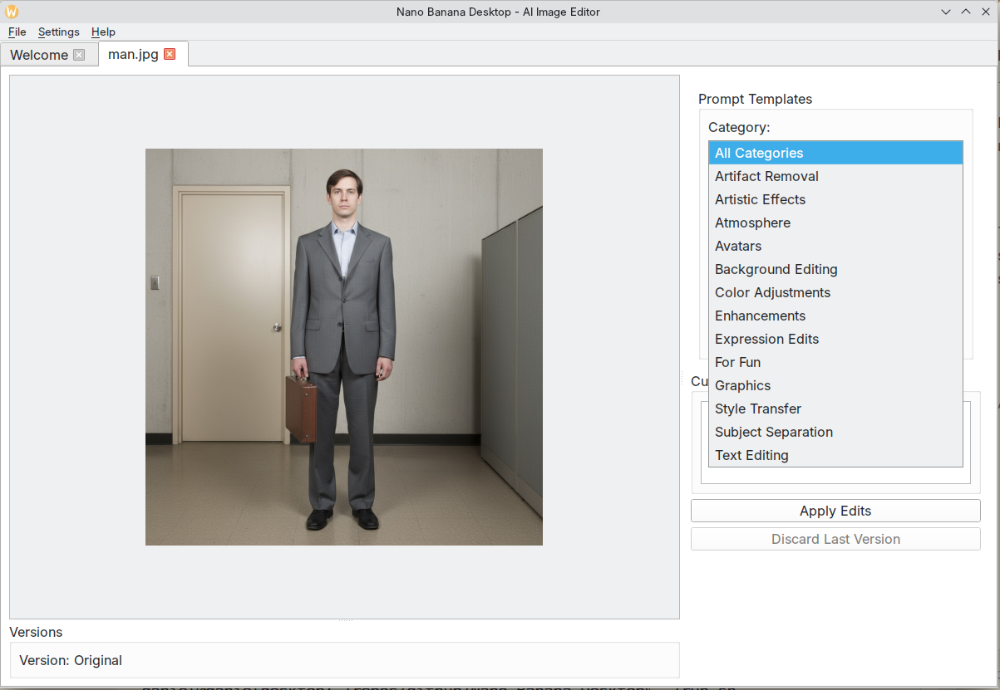

# Nano Banana Desktop



**⚠️ Work in Progress - v1.0.0 Release**

A desktop image editing utility for Linux that leverages Google's Gemini Flash 2.5 Images (Nano Banana) for AI-powered image transformations.

This is an early-stage experimental project that provides a functional desktop interface for applying AI-powered image transformations using Google's Gemini API. The basic implementation has been validated and works reliably for image-to-image transformations using prompt templates.

## Project Status

This v1.0.0 release represents a minimal viable product that demonstrates:
- Working Gemini API integration for image transformations
- Desktop GUI with tab-based workflow
- Prompt template library for common edits
- Basic image versioning and backup

**Future Plans:**
- Support for additional API providers (Claude, Replicate, etc.)
- Enhanced editing capabilities
- More sophisticated prompt management
- Performance optimizations
- Expanded template library

> **Note:** This project was developed using AI-assisted coding (Claude Code) and is released as-is for experimental use.

## Features

- Tab-based interface for managing multiple images
- AI-powered image editing using Gemini's image-to-image capabilities
- Prewritten prompt templates for common edits
- Custom prompt support
- Version control with automatic backup
- Iterative editing workflow
- Multiple aspect ratio support (1:1, 16:9, 21:9, 9:16)
- Secure API key storage

## Screenshots


## Requirements

- Python 3.10 or higher
- Linux with KDE/Qt support
- Google Gemini API key

## Installation

### Option 1: Install from .deb Package (Recommended for Ubuntu)

Download and install the latest .deb package:

```bash
# Download the latest release from GitHub
# Visit: https://github.com/danielrosehill/Nano-Banana-Desktop/releases

# Install the package
sudo dpkg -i nano-banana-desktop_1.0.0_amd64.deb

# Fix dependencies if needed
sudo apt-get install -f
```

After installation, run from terminal:
```bash
nano-banana-desktop
```

Or search for "Nano Banana Desktop" in your application menu.

**Updating:**
```bash
./update-deb.sh  # Auto-downloads and installs latest release
# OR
./update-deb.sh path/to/new-package.deb  # Install specific package
```

### Option 2: Quick Start from Source

1. Clone the repository:
```bash
git clone https://github.com/danielrosehill/Nano-Banana-Desktop.git
cd Nano-Banana-Desktop
```

2. Run the setup script:
```bash
./setup-venv.sh
```

3. Run the application:
```bash
./run.sh
```

## Manual Installation

If you prefer to set up manually:

```bash
cd code
uv venv .venv
source .venv/bin/activate
uv pip install -e ".[dev]"
```

## Usage

Coming soon!

## Building

### Build Standalone Executable

To build a standalone PyInstaller executable:

```bash
./build.sh
```

This will create a self-contained executable at `./dist/nano-banana-desktop` that can be run without needing Python installed.

### Build .deb Package

To build a Debian package for Ubuntu:

```bash
./build-deb.sh
```

This creates a `.deb` package at `./dist/nano-banana-desktop_1.0.0_amd64.deb` that can be distributed and installed on Ubuntu systems.

The .deb package:
- Installs to `/opt/nano-banana-desktop`
- Creates launcher command `nano-banana-desktop`
- Adds desktop entry to application menu
- Manages virtual environment automatically
- Handles dependencies through apt

## Development

This project uses:
- **PySide6** for the GUI
- **google-genai** for Gemini API integration
- **Pillow** for image processing
- **keyring** for secure API key storage

### Project Structure

```
Nano-Banana-Desktop/
├── code/                    # Main codebase
│   ├── nano_banana/        # Python package
│   │   ├── ui/             # GUI components
│   │   ├── core/           # Core functionality and API integration
│   │   └── utils/          # Utility functions (includes prompt loader)
│   ├── prompts/            # Prompt template library
│   │   ├── artistic-effects/
│   │   ├── color-adjustments/
│   │   ├── background-editing/
│   │   └── ... (14 categories total)
│   └── tests/              # Test suite
├── docs/                   # API documentation
├── dev-spec/               # Development specifications
├── setup-venv.sh           # Virtual environment setup script
└── run.sh                  # Application runner script
```

### Prompt Templates

The application includes 14 categories of pre-written prompt templates:
- Artifact Removal
- Artistic Effects (comic book, impressionist, pop art, etc.)
- Atmosphere
- Avatars
- Background Editing
- Color Adjustments
- Enhancements
- Expression Edits
- For Fun
- Graphics
- Style Transfer
- Subject Separation
- Text Editing

## License

TBD

## Author

Daniel Rosehill
